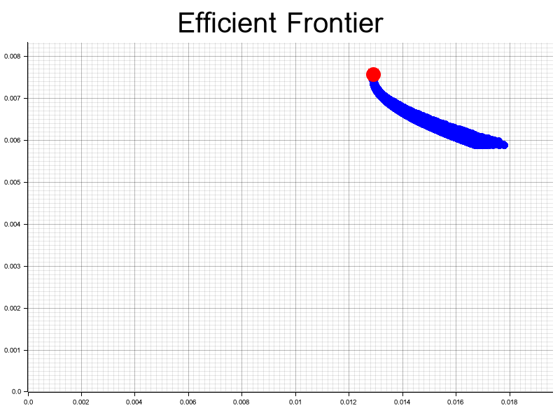

# 📈 Rust Portfolio Optimizer


<div align="center">
  
</div>

<div align="center">
  <h3>💰 Modern Portfolio Theory implementation in Rust</h3>
  <p>Optimize asset allocation and maximize risk-adjusted returns</p>
</div>

---

## 🇧🇷 Descrição em Português

`rust-portfolio-optimizer` é uma ferramenta profissional para **otimização de portfólios de investimento** baseada na **Teoria Moderna do Portfólio (MPT)** de Harry Markowitz. Desenvolvida em Rust, combina **computação numérica de alta performance** com **visualizações profissionais** para encontrar a alocação ótima de ativos.

### ✨ Funcionalidades Principais

- 🎯 **Otimização MPT** - Implementação completa da Teoria Moderna do Portfólio
- 📊 **Fronteira Eficiente** - Cálculo e visualização da fronteira eficiente
- 🔢 **Monte Carlo** - Simulação de 10.000+ portfólios aleatórios
- 📈 **Índice de Sharpe** - Maximização do retorno ajustado ao risco
- 📉 **Visualização** - Gráficos profissionais com Plotters
- ⚡ **Alta Performance** - Computação numérica otimizada com Nalgebra

---

## 🇺🇸 English Description

`rust-portfolio-optimizer` is a professional tool for **investment portfolio optimization** based on Harry Markowitz's **Modern Portfolio Theory (MPT)**. Developed in Rust, it combines **high-performance numerical computing** with **professional visualizations** to find optimal asset allocation.

### ✨ Key Features

- 🎯 **MPT Optimization** - Complete Modern Portfolio Theory implementation
- 📊 **Efficient Frontier** - Calculation and visualization of efficient frontier
- 🔢 **Monte Carlo** - Simulation of 10,000+ random portfolios
- 📈 **Sharpe Ratio** - Maximization of risk-adjusted returns
- 📉 **Visualization** - Professional charts with Plotters
- ⚡ **High Performance** - Optimized numerical computing with Nalgebra

---

## 🚀 Quick Start

### Prerequisites

- [Rust](https://www.rust-lang.org/tools/install) 1.70+
- Git

### Installation

```bash
# Clone the repository
git clone https://github.com/galafis/rust-portfolio-optimizer.git
cd rust-portfolio-optimizer

# Run the optimization example
cargo run --example portfolio_optimization
```

### Example Output

```
Pesos Ótimos: VecStorage { data: [0.963, 0.010, 0.027] }
Gráfico da fronteira eficiente salvo em docs/efficient_frontier.png
```

### Generated Chart

The optimizer generates a professional chart showing the efficient frontier:

<div align="center">
  
</div>

---

## 📚 Usage Example

### Optimizing a Portfolio

```rust
use rpo_optimizer::{calculate_returns, optimize_portfolio};
use rpo_data::load_historical_data;
use nalgebra::DMatrix;

fn main() -> Result<()> {
    // Load historical price data
    let df = load_historical_data("data/historical_prices.csv")?;
    let prices = df.select(["AAPL", "MSFT", "GOOG"])?;

    // Convert to matrix
    let price_matrix = DMatrix::from_vec(
        prices.height(),
        prices.width(),
        prices.to_ndarray()?.into_raw_vec()
    );

    // Calculate returns
    let returns = calculate_returns(&price_matrix);

    // Optimize portfolio
    let (optimal_weights, efficient_frontier) = optimize_portfolio(&returns);

    println!("Optimal Weights: {:?}", optimal_weights);
    println!("Expected Return: {:.2}%", optimal_weights.return * 100.0);
    println!("Volatility: {:.2}%", optimal_weights.volatility * 100.0);
    println!("Sharpe Ratio: {:.2}", optimal_weights.sharpe_ratio);

    Ok(())
}
```

---

## 🏗️ Architecture

The project follows a modular architecture with clear separation of concerns:

<div align="center">
  
</div>

### Project Structure

```
rust-portfolio-optimizer/
├── crates/
│   ├── core/          # Optimization orchestration
│   ├── data/          # Data loading & preprocessing
│   ├── optimizer/     # MPT algorithms & calculations
│   └── utils/         # Visualization & utilities
├── examples/          # Usage examples
├── data/             # Sample historical data
└── docs/             # Documentation & charts
```

### Crate Descriptions

| Crate | Description |
|-------|-------------|
| **rpo-core** | Orchestrates the optimization process |
| **rpo-data** | Loads and preprocesses market data |
| **rpo-optimizer** | Implements MPT algorithms and calculations |
| **rpo-utils** | Provides plotting and utility functions |

---

## 📊 Modern Portfolio Theory

The optimizer implements key concepts from MPT:

### Efficient Frontier

The **efficient frontier** represents the set of optimal portfolios that offer the highest expected return for a given level of risk.

```
Expected Return
      ↑
      │         ●  ← Optimal Portfolio
      │       ● ●
      │     ● ● ●
      │   ● ● ●
      │ ● ● ●
      │● ●
      └──────────────→ Risk (Volatility)
```

### Sharpe Ratio

The **Sharpe Ratio** measures risk-adjusted returns:

```
Sharpe Ratio = (Portfolio Return - Risk-Free Rate) / Portfolio Volatility
```

The optimizer finds the portfolio with the **maximum Sharpe Ratio**.

---

## 🔢 Optimization Algorithm

1. **Load Data**: Historical price data for multiple assets
2. **Calculate Returns**: Compute daily returns from prices
3. **Monte Carlo Simulation**: Generate 10,000 random portfolios
4. **Calculate Metrics**: For each portfolio:
   - Expected return (mean of weighted returns)
   - Volatility (standard deviation)
   - Sharpe ratio
5. **Find Optimal**: Select portfolio with maximum Sharpe ratio
6. **Visualize**: Plot efficient frontier with optimal point

---

## 🛣️ Roadmap

- [ ] Add alternative optimization algorithms (Gradient Descent, SLSQP)
- [ ] Implement portfolio constraints (min/max weights per asset)
- [ ] Support for different risk measures (CVaR, Sortino Ratio)
- [ ] Real-time data integration with market APIs
- [ ] Interactive CLI with portfolio rebalancing suggestions
- [ ] Backtesting of optimized portfolios
- [ ] Multi-period optimization
- [ ] Factor model integration (Fama-French)

---

## 🤝 Contributing

Contributions are welcome! Please feel free to submit a Pull Request.

1. Fork the repository
2. Create your feature branch (`git checkout -b feature/NewOptimizer`)
3. Commit your changes (`git commit -m 'Add new optimization algorithm'`)
4. Push to the branch (`git push origin feature/NewOptimizer`)
5. Open a Pull Request

---

## 📜 License

This project is licensed under the MIT License - see the [LICENSE](LICENSE) file for details.

---

## 👨‍💻 Author

**Gabriel Demetrios Lafis**

- 🎓 Systems Analysis and Development | IT Management | Cybersecurity
- 💼 Data Scientist | Data Analyst | BI/BA
- 🔗 [GitHub](https://github.com/galafis)

---

## 🙏 Acknowledgments

- Built with [Rust](https://www.rust-lang.org/)
- Linear algebra: [Nalgebra](https://nalgebra.org/)
- Visualization: [Plotters](https://plotters-rs.github.io/)
- Inspired by Harry Markowitz's Modern Portfolio Theory

---

## 📚 References

- Markowitz, H. (1952). "Portfolio Selection". *The Journal of Finance*
- Sharpe, W. F. (1966). "Mutual Fund Performance". *Journal of Business*

---

<div align="center">
  <p>Made with ❤️ and Rust</p>
  <p>⭐ Star this repository if you find it useful!</p>
</div>
